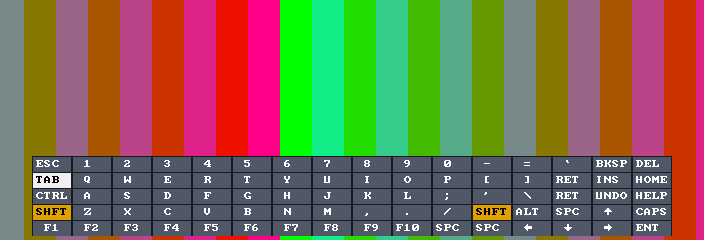

# Atari ST for Analogue Pocket

An openFPGA port of [MiSTery](https://github.com/gyurco/MiSTery), Gyorgy Szombathelyi's cycle-accurate
Atari ST/STE/Mega STE core for the MiST board, to the Analogue Pocket.

> **Status: early pre-release.** On a real Pocket the core loads, boots EmuTOS to the GEM desktop and
> the mouse works. It is still young: if something goes wrong, see [Troubleshooting](#troubleshooting)
> and please [open an issue](https://github.com/defgenx/openfpga-AtariST/issues).

## Features

* ST, STE, Mega STE (16 MHz) and STE Turbo (16 MHz STE with a fast bus, MiSTery's *STEroids*) machines, 512 KB – 14 MB RAM, cycle-accurate 68000 (FX68K)
* TOS and machine stay in sync: *Machine = Auto* reads the TOS version and picks the ST model it needs
* A loading screen with a progress bar while TOS loads, and a **DISK A / DISK B / HDD** badge while the ST reads a disk
* Ready to run: [EmuTOS](https://emutos.sourceforge.io) (free TOS replacement) is bundled; any original
  192 KB or 256 KB TOS works too, and picking another TOS from the menu reloads it
* Two floppy drives using `.st` images, read **and write**, swappable from the Pocket menu
* Two **ACSI hard disks** (`.hd` / `.img` images, read and write): EmuTOS mounts them as C:, D: … directly
* **MIDI IN/OUT or RS-232 serial on the link port**: MIDI IN works with Analogue's *Pocket MIDI IN* cable;
  two Pockets on a link cable play **MIDI Maze** or null-modem games
* **Cartridge port** (`.stc` ROM images) and the **Cubase 2/3 dongle**
* **4-player adapter** (parallel port, Gauntlet II style) using Dock controllers 3 and 4, and the STE joypad ports
* Colour (low/medium res, PAL and NTSC, borders on or off) and monochrome 640×400
* YM2149 + STE DMA sound, Blitter
* Playable handheld: mouse, joystick and keys pad modes (Start), on-screen keyboard (Select)

  

* Dock USB keyboard and mouse, analog stick as mouse

## Installing

Put the microSD card in your computer and run the installer from the
[latest release](https://github.com/defgenx/openfpga-AtariST/releases):

| System        | Run                                                          |
|---------------|--------------------------------------------------------------|
| Windows       | put `install.bat` and `install.ps1` in one folder, double-click `install.bat` |
| macOS / Linux | `chmod +x install.sh && ./install.sh`                        |

It finds the Pocket card, copies the core, the bundled EmuTOS and the guide, and offers to eject the
card. It **asks before replacing any file already on the card** (`[y]es / [N]o / [a]ll / [s]kip all`;
Enter keeps your file). Or unzip `defgenx.AtariST.zip` onto the card root by hand.

On the Pocket: *openFPGA → Atari ST*. EmuTOS is included, so it boots to the GEM desktop without any
other file. Add `.st` floppy images to `Assets/atarist/common/` and load them from *Core Settings →
Floppy A / B*. Full guide: **[INSTALL.md](INSTALL.md)**.

Installer options:

| macOS / Linux        | Windows          | Does                                                   |
|----------------------|------------------|--------------------------------------------------------|
| `--dry-run`          | `-DryRun`        | show what would be copied, change nothing              |
| `--sd /Volumes/NAME` | `-SD E:\`        | install to this card instead of searching for it       |
| `--reset-settings`   | `-ResetSettings` | also erase the core's saved settings (asks first)      |

## Controls

No keyboard needed. **Start** cycles the pad between three modes; a MOUSE / JOYSTICK / KEYS label
confirms each switch. It starts in mouse mode for the GEM desktop.

| Button     | Mouse (default)    | Joystick                | Keys          | On-screen keyboard  |
|------------|--------------------|-------------------------|---------------|---------------------|
| D-pad      | move the pointer   | joystick (ST game port) | arrow keys    | move the key cursor |
| A          | left click         | fire                    | Space         | press the key       |
| B          | right click        | fire 2                  | Return        | close the keyboard  |
| X          | Space              | Space                   | Esc           | –                   |
| Y          | Return             | Return                  | Help          | –                   |
| L / R      | left / right click | –                       | F1 / F2       | –                   |
| **Select** | show keyboard      | show keyboard           | show keyboard | close the keyboard  |
| **Start**  | → joystick         | → keys                  | → mouse       | –                   |

Use **Keys** mode for games played on the keyboard (arrow keys, Space, Return, F1/F2 menus), and the
on-screen keyboard (Select) for typing; its Ctrl / Shift / Alt are sticky: press Shift, then the letter.
In the Dock, a USB keyboard and mouse work as on a real ST (Page Up = Help, Page Down = Undo) and an
analog stick moves the mouse. Details: [docs/input.md](docs/input.md).

## Core settings

On the Pocket: press the Analogue button while the core runs → *Core Settings*.

| Setting            | Values                               | Notes                                                    |
|--------------------|--------------------------------------|----------------------------------------------------------|
| Reset ST (warm)    | –                                    | like the reset button on a real ST, except that a game's reset handler can't catch it: TOS always boots again and runs the disk in *Floppy A* |
| Cold Restart       | –                                    | clears memory, reloads TOS, restarts from scratch        |
| Machine            | **Auto** / ST / STE / Mega STE / STE Turbo | **Auto** (default) picks the machine your TOS needs: TOS 1.06/1.62 and 256 KB EmuTOS (the bundled `tos.img`) → STE, TOS 2.05 → Mega STE, anything else (TOS 1.00–1.04, 2.06, 192 KB EmuTOS) → ST. The installer lists each TOS on the card with the machine Auto picks for it. Pick one yourself only if you know the TOS supports it; STE Turbo is not a real Atari model |
| Memory             | 512 KB … 14 MB (1 MB default)        | cold restart; with original Atari TOS, 8/14 MB are capped to 4 MB automatically (EmuTOS uses them) |
| Monitor            | Colour / Mono (SM124)                | cold restart; mono is 640×400 high-res software only     |
| Blitter (ST only)  | Off / On                             | the STE and Mega STE always have one                     |
| YM Stereo          | Off / On                             | spreads the three sound channels left/right              |
| Write Protect      | A and B / B only / A only / None     | floppies are protected by default — keep backups         |
| Borders            | Show / Hide                          | hide to fill the screen with the 320×200 / 640×200 area  |
| Pad Mode           | Mouse / Joystick / Keys              | the mode the pad starts in; Start cycles them            |
| Mouse Speed        | Slow / Normal / Fast                 | speed of the D-pad mouse                                 |
| Reset All Settings | –                                    | every setting back to its default, then a cold restart   |
| STE Joypad Ports   | –                                    | switches pads 1/2 between the ST joystick ports and the STE enhanced ports (same as F11 on MiST/MiSTer) |
| TOS / Floppy A / B | file picker                          | a new TOS reloads and restarts; disks swap live          |
| Link Port          | Off / MIDI / Serial                  | the link port carries MIDI or the RS-232 port: IN on pin 3 (SI), OUT on pin 2 (SO); leave Off for other link devices |
| Cubase Dongle      | Off / On                             | the copy-protection key Cubase 2 / 3 look for on the cartridge port |
| Cartridge          | file picker                          | `.stc` cartridge ROM (up to 128 KB) at $FA0000; picking one cold-restarts |
| Hard Disk 0 / 1    | file picker                          | ACSI images (`.hd`, `.img`); *Cold Restart* to boot from a new one |

Settings are saved on the card (`Settings/defgenx.AtariST/`) and come back at the next start.

## Troubleshooting

| What you see | What to do |
|---|---|
| **"Load error in 'core'" / "General error"** when starting the core | An old or mixed install. Run the installer again and answer **a** (replace all), or delete `Cores/defgenx.AtariST/` from the card first. |
| **A white or black screen for a while after picking a disk** | The ST is reading the floppy at real-drive speed; the red *DISK A* badge (top right) shows it is working. Games often take 10–30 s to boot, as on a real ST. |
| **Bombs, a bus error or a black screen after changing a setting** | *Core Settings → Reset All Settings*. If the menu doesn't help, erase the saved settings: `./install.sh --reset-settings` (Windows: `install.bat -ResetSettings`), or delete `Settings/defgenx.AtariST/` on the card. |
| **The ST hangs or acts strangely after a crash** | *Core Settings → Cold Restart*. *Reset ST (warm)* keeps memory, like a real ST's reset button. |
| **Testing which TOS + floppy combination auto-starts a game** | Pick the TOS (the ST restarts with it), put the disk in *Floppy A*, then *Reset ST (warm)*: TOS boots the disk, even when the last game installed a reset handler. |
| **"Data on the disk in drive A: may be damaged"** | The core now retries sector reads the Pocket answers with an error, one possible cause. If it still happens, check the image is a raw `.st` of a standard size (360/720/800 KB …). |
| **Black screen at start** | `Assets/atarist/common/tos.img` is missing or not a raw 192/256 KB TOS (exactly 196,608 or 262,144 bytes). Re-run the installer, or copy `tos.img` from the release zip. |
| **The D-pad does nothing on the desktop** | You are in joystick or keys mode. Press **Start** until the label shows MOUSE. |
| **A game ignores the joystick** | Press **Start** until the label shows JOYSTICK. If the game is played on the keyboard, use KEYS mode instead. |
| **Blank screen or crash after changing *Machine* or *Memory*** | Set *Machine* back to **Auto**: it always matches the TOS. A TOS that doesn't support the machine you picked boots to a blank screen. |
| **Crash with *Machine = STE* or *Mega STE*** | The TOS doesn't support that machine: 192 KB TOS (1.00–1.04, `emutos-192k-*.img`) is ST only. Use `tos.img` (256 KB EmuTOS) or TOS 1.06/1.62/2.06. |
| **Memory setting has no effect, or the screen breaks after changing it** | Fixed in v0.1.4: update. The change must cold-restart the ST; a warm reset keeps the old memory layout. |
| **A game or demo refuses to run** | It may need Atari's original TOS rather than EmuTOS (copy your dump as `tos.img`), or a specific machine (try *Machine = ST*, *Memory = 1 MB*). |
| **Hard disk not seen** | EmuTOS reads FAT16 partitions (MBR or Atari partition table) by itself. With original Atari TOS, the disk needs a driver on it (AHDI, HDDriver, ICD). Choose *Cold Restart* after picking a new image. |
| **A disk is not seen** | Only raw `.st` images work; convert `.msa` / `.stx` first (e.g. Hatari's `hmsa`). Load it in *Floppy A* and choose *Cold Restart* to boot from it. |
| **A game cannot save** | Floppies are write-protected by default: set *Write Protect* to *None* (keep a backup of the disk). |
| **Want a CRT or LCD look** | In the Pocket's *Display Mode* menu (Analogue button → Settings → Display), pick *CRT Trinitron*, *Backlit / Reflective Color LCD* or *Grayscale LCD*. |
| **Mono mode: picture off-centre or black** | Mono timing is not yet verified on hardware; switch *Monitor* back to *Colour*. |

When reporting a problem, please say which version (`version` in `Cores/defgenx.AtariST/core.json`), the
settings you changed, and what is on screen — a photo of a bus-error screen (the `PC` and `addr` values)
is very useful.

## Building

Requirements: Quartus Prime Lite (the Pocket's Cyclone V 5CEBA4), or Docker, plus Python 3.

```sh
git clone --recursive <this repo>
./build.sh            # compile (native quartus_sh if on PATH, else the raetro/quartus Docker image) and package
./build.sh package    # only package an existing src/fpga/output_files/ap_core.rbf
```

On Apple Silicon the Docker build runs under x86 emulation and is slow; the image needs ~15 GB of free
space in Docker's VM.

## Tests

```sh
make -C sim           # needs Icarus Verilog and Verilator
```

* `media` / `media256`: `st_media` against a model of APF's target commands and datatable — 192 KB
  and 256 KB TOS loads (addresses and data, word by word), sector read, sector write, disk mount and swap.
* `hid`: `hid_ps2` driving MiSTery's own IKBD PS/2 decoder — key matrix (including extended keys and
  modifiers) and exact mouse quadrature counts.
* `video`: `st_video` with the measured PAL/NTSC/mono sync timing — every frame has the scaler mode's
  exact width, height and slot id.
* `system`: the whole ST (MiSTery) boots a TOS at every RAM size and through RAM changes, and checks the
  memory size and screen address TOS sets up. `make -C sim system TOS=your_tos.img` tests your own TOS.
* `osk`: on-screen keyboard navigation, held keys and sticky modifiers; also renders a frame to
  `sim/osk_frame.png` (a copy is in [docs/osk.png](docs/osk.png)).

## Known gaps

* Only lightly tested on hardware: Dock keyboard/mouse and floppy writing in particular need confirming.
* Mono and medium-res horizontal positions are estimated ([docs/video.md](docs/video.md)).
* No Atari Falcon: it needs about twice the Pocket's FPGA.
* No printer port (its pins carry the 4-player adapter), Viking hi-res, `.msa`/`.stx` images.
* MIDI, serial and the cartridge port are untested on hardware.

## Documentation

* [docs/architecture.md](docs/architecture.md) — how the MiST board layer was replaced, media flow, settings map
* [docs/video.md](docs/video.md) — measured ST video timing and scaler windows
* [docs/input.md](docs/input.md) — controls, Dock keyboard/mouse translation

## Credits and licence

* [MiSTery](https://github.com/gyurco/MiSTery) by Gyorgy Szombathelyi, with FX68K and the Blitter by
  Jorge Cwik, the IKBD by Till Harbaum and the GSTMCU schematics recovered by Christian Zietz — GPL.
  Included unmodified as a submodule.
* Analogue's [openFPGA core template](https://github.com/open-fpga/core-template) (`src/fpga/apf`,
  `core_bridge_cmd.v`).
* `sound_i2s.sv` and `sync_fifo.sv` from [analogue-pocket-utils](https://github.com/agg23/analogue-pocket-utils)
  by Adam Gastineau — MIT.
* [EmuTOS](https://emutos.sourceforge.io) 1.4, bundled unmodified in `dist/Assets/atarist/common/` — GPL v2
  (source: https://sourceforge.net/projects/emutos/files/emutos/1.4/).
* On-screen keyboard font: [font8x8](https://github.com/dhepper/font8x8) by Daniel Hepper — public domain.
* Handheld control scheme modelled on [Mazamars312's Pocket Amiga core](https://github.com/Mazamars312/Analogue-Amiga).

The Pocket-specific code in this repository is distributed under the GPL, like the MiSTery core it
builds on.
